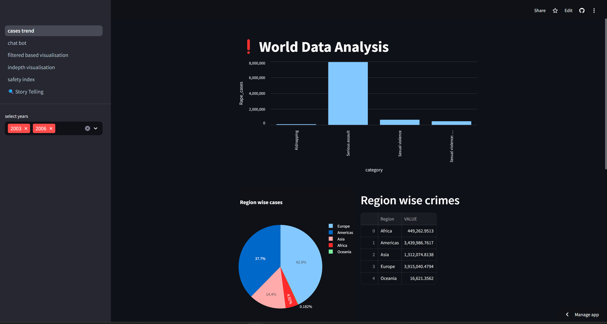

# Rape Cases in India - From 1970-2020

### Overview
This project provides an analytical view of rape cases in India using Python and Streamlit to create an interactive dashboard. The aim is to visualize trends, patterns, and insights from the dataset, making it easier to understand the gravity of the situation and areas of concern.

### Features
- Interactive Dashboard: Built using Streamlit, offering user-friendly interaction with the data.
- Data Analysis: Leveraging Python’s pandas, matplotlib, and seaborn for data processing and visualization.
- Visual Insights: The dashboard includes bar charts, line graphs, and heatmaps to visualize trends over time, regional variations, and other important statistics.
  
### Dataset
The dataset contains information on reported rape cases across different states and regions in India, spanning several years. The data has been cleaned and processed to facilitate meaningful analysis.

### Libraries Used
- Streamlit: For building the interactive dashboard.
- Pandas: For data manipulation and cleaning.
- Matplotlib & Seaborn: For creating data visualizations.
- Plotly: For interactive charts.
  
### Dashboard Features
- State-wise analysis: View cases across different states in India.
- Year-wise trend: Visualize how the number of cases has changed over time.
- Comparative charts: Compare different regions and time periods.
- Insights and Conclusions: Analyze the overall trends and highlight areas that require attention.

### Future Work
- Adding more interactive filters.
- Expanding the dataset to include other relevant statistics.
- Implementing machine learning models to predict future trends.
